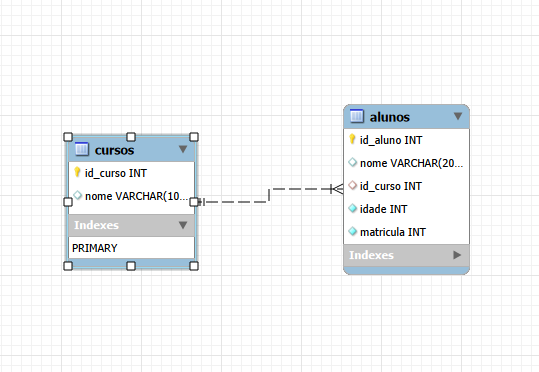

<h1 align="center"> 
    🚀✅Projeto Banco de Dados - Alunos - Concluído ✅🚀
</h1>

<p align="center">
 <a href="#-descrição-do-entregável">Descrição do entregável</a> •
 <a href="#-sobre-o-projeto">Sobre</a> •
 <a href="#-funcionalidades">Funcionalidades</a> •
 <a href="#-como-executar-o-projeto">Como executar</a> • 
 <a href="#-tecnologias">Tecnologias</a> • 
 <a href="#-autor">Autor</a> • 
 <a href="#user-content--licença">Licença</a>
</p>

---

## 📄 Descrição do entregável

Este projeto é um repositório de **prática de SQL** para demonstrar minhas habilidades com banco de dados.  
Ele contém a criação de um banco de dados, tabelas e consultas SQL de diferentes tipos: `SELECT`, `GROUP BY`, `JOIN`, `INSERT`, `UPDATE` e `DELETE`.

---

## 💻 Sobre o projeto

O **Projeto SQL** foi criado para praticar e demonstrar conhecimentos em SQL e modelagem de banco de dados.  
O projeto inclui:  
- Criação de banco de dados e tabelas.  
- Consultas básicas e avançadas (`SELECT *`, `GROUP BY`, `JOIN`).  
- Inserção, atualização e exclusão de dados.  

---


## 🎨 Layout / Diagrama do Banco de Dados

### Diagrama das Tabelas



 Este diagrama mostra as tabelas `cursos` e `alunos` e o relacionamento entre elas.

### ✅ Pré-requisitos

Antes de começar este projeto, você precisará ter instalado em seu computador:

- Um **banco de dados**, podendo ser:
  - **MySQL Workbench** (recomendado)
  - **phpMyAdmin**
  - Ou outro de sua preferência
- Conhecimentos básicos de **SQL** (como `CREATE`, `INSERT`, `SELECT`, etc.)

  ## 🚀 Como executar o projeto

1. Clone o projeto:
   ```bash
    https://github.com/Joao-vitorSantos08/mysql-controle_escolar.git

2. Abra o banco de dados usando MySQL Workbench, phpMyAdmin ou outro cliente SQL de sua preferência.

3. Importe o arquivo .sql que contém todo o banco de dados e tabelas incluído no projeto.

4. Abra o arquivo consultas.sql no cliente SQL e execute as queries para testar e praticar:

-  SELECT 

- GROUP BY e COUNT

- JOIN

- INSERT, UPDATE e DELETE

  
 ### 💻 Tecnologia utilizada

- **SQL / MySQL** – Criação e manipulação do banco de dados

## 🛠️ Ferramentas
 
- **Git** – Controle de versão  
- **GitHub** – Hospedagem e gerenciamento do código-fonte  
- **MySQL Workbench** – Criação e manipulação do banco de dados


## ⚙️ Funcionalidades

- [x] Criar banco de dados e tabelas.  
- [x] Consultas básicas com `SELECT *`.  
- [x] Agrupamento de dados com `GROUP BY` e contagem (`COUNT`).  
- [x] Relacionamento entre tabelas com `JOIN`.  
- [x] Inserir registros com `INSERT`.  
- [x] Atualizar registros com `UPDATE`.  
- [x] Remover registros com `DELETE`.  

 ## 💪 Como contribuir para o projeto

1. Faça um **fork** do projeto.
2. Crie uma nova branch com as suas alterações: `git checkout -b my-feature`
3. Salve as alterações e crie uma mensagem de commit contando o que você fez: `git commit -m "feature: My new feature"`
4. Envie as suas alterações: `git push origin my-feature`
> Caso tenha alguma dúvida confira este [guia de como contribuir no GitHub](./CONTRIBUTING.md)

## 👨🏽‍💻 Autor

<a href="https://www.linkedin.com/in/jo%C3%A3o-vitor-santos-souza-844306360/">
João Vitor Santos souza</a>
 <br />
